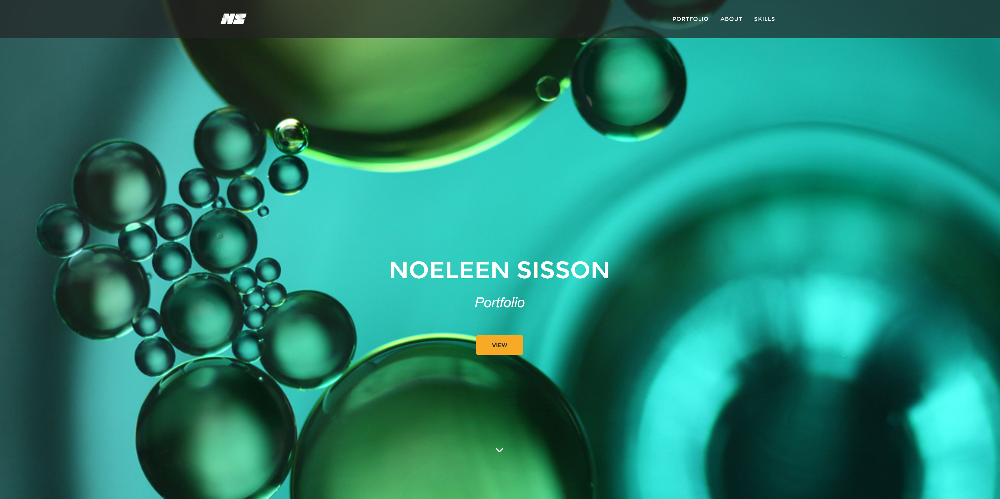

# Noeleen Sisson Portfolio Website

My portfolio website showcasing various projects I have worked on.

## ✨ Overview  
This is my personal portfolio site, created to present my skills, experience, and selected projects to potential employers and collaborators. It reflects my design expertise, development skills, and the type of work I enjoy.

## 🔗 Live Demo  
[Visit the live site](https://noeleenbv.github.io)  
 <!-- optional image -->

## 🛠️ Tech Stack  

- **Frontend:**  
  HTML, CSS, JavaScript  

- **Hosting:**  
  GitHub Pages
  
- **Libraries & Tools:**  
  - [Font Awesome](https://fontawesome.com/) – Icon toolkit  
  - [AOS (Animate On Scroll)](https://michalsnik.github.io/aos/) – Scroll-based animations  
  - [cbpAnimatedHeader.js](https://tympanus.net/codrops/2013/06/06/on-scroll-animated-header/) – Animates header visibility on scroll  
  - [SVGeezy](https://benhowdle.im/svgwithfallback/) – Automatic image fallback for browsers that don't support SVGs  
  - [smoothscroll.js](https://github.com/iamdustan/smoothscroll) – Adds smooth scrolling behavior for anchor links  

- **Build Tools / Packages:**  
  - [clean-css](https://github.com/jakubpawlowicz/clean-css) – CSS minifier  
  - [PurgeCSS](https://purgecss.com/) – Removes unused CSS to reduce file size  
  - [Autoprefixer](https://github.com/postcss/autoprefixer) – Adds vendor prefixes to CSS for better browser support  

## 🌟 Features

- **Responsive Design** – Optimized for all screen sizes  
- **Scroll Animations** – Smooth transitions using AOS (Animate On Scroll)  
- **SVG Fallbacks** – Ensures compatibility for older browsers with SVGeezy  
- **Performance Optimizations** – Minified and purged CSS, autoprefixed for cross-browser support  
- **Project Showcase** – Highlights real-world work including branding, UI/UX, and microsites for major brands  
- **About Me Section** – Brief personal intro with career background  
- **Skills Overview** – Summary of tools and technologies used (Figma, Photoshop, HTML/CSS/JS, etc.)  
- **Contact Info** – Easy ways for viewers to get in touch

